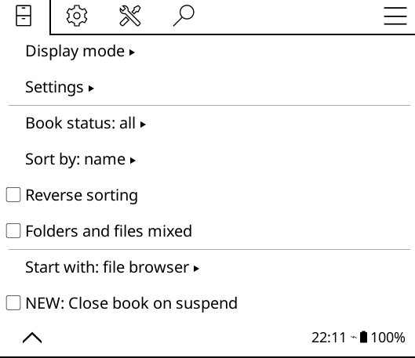

# Close Book on Suspend

A KOReader plugin that allows you to close your current book when the device goes to suspend or sleep (screensaver).    
This will enable you to preserve your reading statistics when reopening the app.

The code for this plugin was inspired by this [Github Issue](https://github.com/koreader/koreader/issues/11751) by `tymmej`.

## Features: 
- When enabled, closes current book and goes to Home.
- Can be disable and will go back to default behavior.
- Has Actions that can be used on Profile.

## Instalation
- Download the latest [ZIP](https://github.com/oraliahdz/close-book-on-suspend/archive/refs/heads/main.zip) and extract the archive.
- Copy the folder `closebookonsuspend.koplugin` to your KOReader installation, inside the `plugins` folder. 
    - For Kobo devices, this is usually `.adds/koreader/plugins` in the device storage.
- Restart KOReader.

## Usage:
- Open KOReader.
- From the file browser menu check `Close book on suspend`.

## Tested On:
- Kindle Paperwhite (7th gen)
- Kindle Paperwhite (10th gen)

